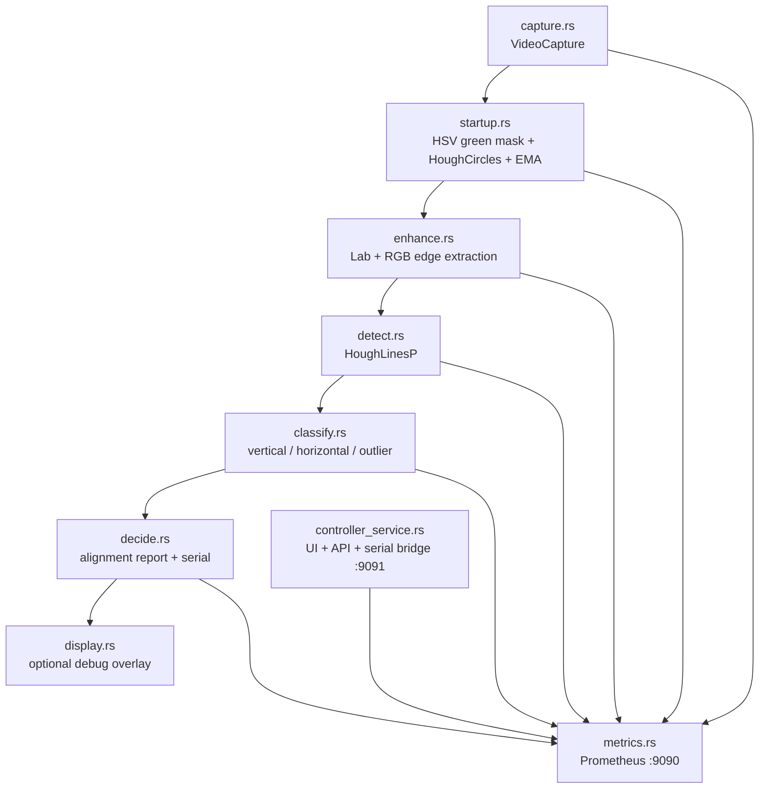

# HOW IT WORKS

## Overview

This program estimates how far the camera is rotated relative to an office-roof grid and now also hosts the RP2350 controller bridge used during roof-alignment bring-up. It is designed as a headless-first sensor service for the Rock Pi 4, with optional debug display during tuning. The output is a signed angle relative to the roof's vertical grid lines, plus confidence and spread metrics, and the same process also exposes controller telemetry, logs, and a browser UI.

The camera pipeline now has two phases. At startup, a green-circle detector runs by itself and waits for a strong enough trigger to send `mode auto` once. After that one-way handoff, the existing roof-alignment pipeline runs normally until the operator resets the startup gate. Bounded channels are still used so capture, startup gating, enhancement, line detection, classification, alignment estimation, and metrics can overlap without building unbounded queues. The controller service runs in a separate thread beside that pipeline and feeds Prometheus through the same metrics path.

## Pipeline



Main channels are `bounded(2)`, which means slow downstream work naturally backpressures the pipeline instead of allowing stale frames to pile up. Before handoff, the startup gate consumes frames itself and does not forward them into the roof-alignment stages.

## Runtime Surfaces

The process exposes three different operational surfaces:

1. Roof-alignment metrics on `:9090/metrics`.
2. Controller browser UI and JSON API on `:9091`.
3. Optional downstream serial output from the alignment stage when `ROOF_SERIAL_PORT` is set.

In the current deployment model, this process runs on the laptop/vehicle and reverse-tunnels ports to `ronstad.se` using `autossh`.

- `9091` is tunneled for controller UI access via `car.ronstad.se`.
- `9092` is tunneled for Prometheus access via `prometheus.e7012e.ronstad.se`.
- Grafana is served via `e7012e.ronstad.se`.

Those public endpoints are terminated by Traefik ingress with cert-manager TLS.

## Why The Old BW Path Failed

If the roof scene has light gray lines on nearly white tiles, a straight BGR-to-grayscale conversion can wash out weak differences. That loses two useful cues:

1. Small luminance differences can get flattened when the three color channels are averaged into one plane.
2. Slight color shifts between line paint, lighting, and tile material can still produce edges in one channel even when the grayscale image looks almost flat.

The enhancement stage now keeps more information by using multiple edge sources instead of trusting one grayscale image.

## Stage 1: Capture

`src/capture.rs` opens the USB camera, reads frames continuously, and forwards each frame downstream. The camera index defaults to `DEFAULT_CAMERA_INDEX` and can be overridden with `ROOF_CAMERA_INDEX`.

## Stage 2: Startup Gate

`src/startup.rs` runs before any roof-grid processing starts.

While the process is in `search_green` mode, it does only this work:

1. Convert the raw BGR frame to HSV.
2. Apply a green `in_range` mask.
3. Blur the mask and run `HoughCircles`.
4. Score the best candidate by how much of the circle area is actually green.
5. Smooth that score with an EMA.

If the EMA crosses the startup threshold, the stage sends `mode auto` through the same controller command path the browser UI uses. That keeps the host-side controller snapshot, browser telemetry, and the serial output in sync. After that succeeds, the process latches into `roof_alignment` mode and forwards subsequent frames into the normal line-based pipeline.

If the operator presses the startup reset button in the UI, the stage returns to `search_green` and clears the previous EMA and circle state.

## Stage 3: Enhancement

`src/enhance.rs` builds a line-friendly edge map in one fast pass:

1. Crop the frame to the clean central region so edge clutter near the lens borders is removed early.
2. Optionally downscale that cropped region before the expensive filters run.
3. Convert the cropped frame to Lab and extract the `L` channel.
4. Run blur + Canny on that enhanced luminance view.
5. Apply a small dilation so broken seams connect before Hough.

This is intentionally cheaper than the earlier multi-channel path. Detection now runs a single Hough pass over that prebuilt edge map at a more aggressive downscale, with stricter thresholds to reduce noisy line fragments while still forwarding all candidates that survive Hough.

## Stage 4: Detection

`src/detect.rs` runs a single `HoughLinesP` pass over the prepared edge image. The detector works on the downscaled image, so the effective threshold, minimum line length, and gap settings are scaled with the processing resolution instead of using the raw camera-space numbers directly.

Each candidate line is converted into a `RawLine` with:

- start point
- end point
- wrapped angle in `[0, 180)`
- pixel length

That keeps the next stage focused on geometry instead of OpenCV-specific line storage.

## Stage 5: Classification

`src/classify.rs` compares each detected line against the expected roof axes:

- horizontal target: `0°`
- margin: `±30°`

Each line becomes one of:

- `Vertical`
- `Horizontal`
- `Outlier`

For the vertical and horizontal groups, the stage computes:

- count
- weighted mean angle error
- min/max angle error
- spread
- standard deviation

Those numbers are used both for telemetry and for deciding whether the frame contains a reliable grid estimate.

## Stage 6: Alignment Estimate

`src/classify.rs` builds the `AlignmentReport`, and `src/decide.rs` logs it, exports metrics, and forwards serial output.

The preferred estimate is still the vertical-line cluster, because the corridor-following use case defines zero degrees relative to the roof's vertical grid lines. But horizontal lines are not just logged: if the frame does not contain enough vertical inliers and the horizontal cluster is the only reliable one, the final `angle_from_vertical_deg` falls back to that horizontal-based estimate. That matters in this corridor because some sections show many clearer horizontal seams than vertical ones, while other sections do the opposite.

The report includes:

- chosen signed angle from vertical
- dominant axis used for the estimate (`vertical` or `horizontal`)
- confidence
- total, vertical, horizontal, and outlier counts
- min/max/spread/stddev for vertical and horizontal clusters

The current selection rule is simple: prefer vertical when it has at least `MIN_CLASSIFIED_LINES`, otherwise use horizontal when it has at least that many lines, otherwise report no dominant axis.

The decide stage emits a compact serial command frame each cycle.

## Serial Output

`src/serial.rs` is currently a non-blocking boilerplate path. If `ROOF_SERIAL_PORT` is set, the app attempts to open that port and send a command shaped like this:

```text
align <angle_rad> <confidence>
```

Angle is in radians (6 decimal places). Confidence is in `[0, 1]` (4 decimal places).

This is intentionally simple for bring-up with a Pico2. The internal data model is already structured so a binary protocol can replace the CSV encoder later without changing the upstream pipeline.

## Controller Service

`src/controller_service.rs` hosts a second thread that reuses the old simple-server workflow inside the Rust process instead of relying on the separate Python app.

Its responsibilities are:

1. Serve the embedded controller UI from `src/controller_ui.html` on `:9091`.
2. Expose JSON endpoints for connect, disconnect, mode changes, command send, telemetry readout, and log download.
3. Open the RP2350 serial port, clone the handle for a reader thread, and keep a shared host-side snapshot of the latest values.
4. Accept both the older simple 4-column stream and the RP2350 `simple_csv` 14-column event stream.
5. Ignore echoed commands, `OK`, `ERR`, and comment lines so command traffic does not inflate parse errors.
6. Append controller, hall, and ultrasound events to CSV logs in `controller_logs/`.

The UI adds:

- serial connect and disconnect controls
- a joystick for steering and throttle PWM
- steering and throttle sensitivity sliders
- constants tuning controls with preset dropdown names and free-text entry
- constants file upload that expands into batched `const <name> <value>` commands
- manual and auto mode buttons with `both`, `steering`, and `throttle` targets
- startup-gate status and reset controls
- live telemetry polling
- controller log download links

Manual PWM commands are blocked while auto mode is active, except for neutral recentering and explicit mode changes.

## Controller Telemetry Flow

The RP2350 sends event-tagged serial lines. The host currently understands three families:

1. `controller` rows carrying steer PWM, throttle PWM, setpoint, error, and Kalman state.
2. `hall_delta_t` rows carrying hall timing data.
3. `ultrasound` rows carrying distance sensor values.

The controller thread keeps the latest value for each field in memory, writes the raw event into a host CSV log, and forwards the reduced snapshot into the shared Prometheus exporter. That means Grafana can show controller state and distance sensors without running a second exporter.

## Metrics And Grafana

`src/metrics.rs` exposes Prometheus metrics on `:9090/metrics`. The dashboard under `monitor/` tracks both roof-alignment and controller data:

Controller/vehicle panels are placed at the top of the dashboard so link state, mode, PWM, speed, and tuning are immediately visible during operation.

- chosen angle
- confidence
- total, vertical, horizontal, and outlier line counts
- min and max detected angles
- vertical and horizontal deviation
- requested and driver-applied camera settings
- live capture FPS and frame period
- per-stage p01 and p99 wall time
- per-stage p01 and p99 CPU time
- per-stage p01 and p99 wait time (`wall - cpu`) so capture stalls stand out separately from CPU bottlenecks
- per-stage throughput
- controller link and manual/auto mode
- steering PWM, throttle PWM, speed, setpoint, and error
- steering and throttle sensitivity
- parser and serial error counters
- distance sensor values
- hall delta-t
- Kalman state values

Prometheus and Grafana are hosted on `ronstad.se` in Kubernetes and exposed via Traefik ingress. The car UI ingress routes to an external backend (`vehicle-ui-external`) so traffic can reach the reverse-tunneled UI port when the local service is running.

## Debug Display

The default build is headless. For local tuning, build without the default `no-display` feature:

```bash
cargo run --no-default-features
```

The display shows different content depending on phase:

- `search_green`: raw frame, green mask, and annotated startup-circle overlay
- `roof_alignment`: raw frame, enhanced luminance view, combined edge image, and annotated line overlay

## Tuning Notes

If the roof grid is still weak in difficult lighting, the first things to tune are in `src/consts.rs`:

- `PROCESSING_DOWNSCALE`
- `CLAHE_CLIP_LIMIT`
- `CANNY_LOW_THRESHOLD`
- `CANNY_HIGH_THRESHOLD`
- `PRIMARY_HOUGH_THRESHOLD`
- `PRIMARY_HOUGH_MIN_LINE_LENGTH`
- `PRIMARY_HOUGH_MAX_LINE_GAP`

If the detector is too noisy, first raise the Hough threshold or minimum line length before touching the enhancement stage. If faint seams are still missing after that, lower the Hough settings only after checking that the enhancement stage is actually exposing the lines.
